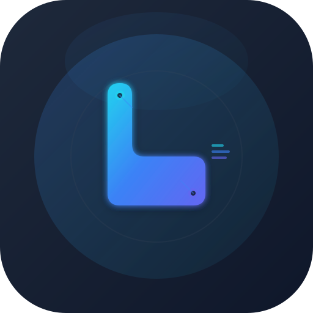

#  Leaguedex

**[Watch in action](https://www.youtube.com/watch?v=SL_V0_jrz7c)**

## What is Leaguedex?

Leaguedex is a Text-to-Speech (TTS) engine that provides personalized coaching for League of Legends players through human-created cues. Create custom CuePacks tailored to your playstyle - whether you're practicing jungle tracking, wave management, or objective control. Get real-time audio reminders during your games to reinforce good habits and decision making.

**Our core features are, and will always remain, free.**

## Contribution

We welcome contributions from the community! Our development approach emphasizes test-driven development as much as possible, though the frontend is primarily AI-generated.

If you're motivated to help out, you can reach us on Discord. Find the invite link [here](https://join.leaguedex.app).

